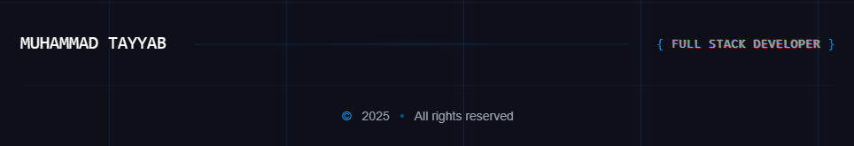

# DevsFolio - Modern Developer Portfolio



A modern, interactive, and fully responsive developer portfolio built with Next.js, Three.js, and Prismic CMS. Features a stunning cyberpunk-inspired design with fluid animations and 3D elements.

🔗 **[View Live Demo](https://devsfolio-seven.vercel.app)**

## ✨ Features

- 🎨 **Modern UI/UX** - Cyberpunk-inspired design with a futuristic aesthetic
- 🌟 **3D Interactions** - Interactive 3D elements using Three.js
- 📱 **Fully Responsive** - Seamless experience across all devices
- ⚡ **Performance Optimized** - Built with performance best practices
- 🔄 **Dynamic Content** - Powered by Prismic CMS for easy content updates
- 📧 **Contact Integration** - EmailJS integration for contact form
- 🎭 **Smooth Animations** - GSAP and Framer Motion animations
- 🎯 **SEO Optimized** - Built-in SEO best practices

## 🛠️ Tech Stack

- **Framework**: [Next.js 15.2](https://nextjs.org/)
- **Styling**: [TailwindCSS 4.0](https://tailwindcss.com/)
- **3D Graphics**: [Three.js](https://threejs.org/) with [@react-three/fiber](https://docs.pmnd.rs/react-three-fiber)
- **Animations**:
  - [GSAP](https://greensock.com/gsap/)
  - [Framer Motion](https://www.framer.com/motion/)
- **CMS**: [Prismic](https://prismic.io/)
- **Email**: [EmailJS](https://www.emailjs.com/)
- **Deployment**: [Vercel](https://vercel.com)

## 🚀 Getting Started

### Prerequisites

- Node.js 18+
- npm or yarn or pnpm or bun

### Installation

1. Clone the repository:
```bash
git clone https://github.com/yourusername/devsfolio.git
```

2. Install dependencies:
```bash
npm install
# or
yarn install
# or
pnpm install
# or
bun install
```

3. Create a `.env.local` file in the root directory:
```env
NEXT_PUBLIC_EMAILJS_SERVICE_ID=your_service_id
NEXT_PUBLIC_EMAILJS_TEMPLATE_ID=your_template_id
NEXT_PUBLIC_EMAILJS_PUBLIC_KEY=your_public_key
```

4. Run the development server:
```bash
npm run dev
# or
yarn dev
# or
pnpm dev
# or
bun dev
```

5. Open [http://localhost:3000](http://localhost:3000) in your browser.

## 📁 Project Structure

```
devsfolio/
├── src/
│   ├── app/              # Next.js app router
│   ├── components/       # Reusable components
│   ├── slices/          # Prismic slice components
│   └── prismicio.ts     # Prismic configuration
├── public/              # Static assets
└── ...config files
```

## 🎨 Key Components

- **Hero Section**: Interactive 3D particle animation
- **About Me**: Animated tech stack and experience cards
- **Projects**: Dynamic project showcase with modal views
- **Blog**: Blog section with rich text content
- **Contact**: Interactive contact form with EmailJS integration

## 📝 Content Management

This portfolio uses Prismic CMS for content management. To update content:

1. Create a Prismic account
2. Set up your repository
3. Create content types matching the existing structure
4. Update the `prismicio.ts` configuration

## 🚀 Deployment

The easiest way to deploy your portfolio is using [Vercel](https://vercel.com):

1. Push your code to GitHub
2. Import your repository to Vercel
3. Add environment variables
4. Deploy!

## ⚙️ Environment Variables

Required environment variables:

```env
NEXT_PUBLIC_EMAILJS_SERVICE_ID=
NEXT_PUBLIC_EMAILJS_TEMPLATE_ID=
NEXT_PUBLIC_EMAILJS_PUBLIC_KEY=
```

## 🤝 Contributing

Contributions are welcome! Please feel free to submit a Pull Request.

## 📄 License

This project is licensed under the MIT License - see the [LICENSE](LICENSE) file for details.

## 🙏 Acknowledgments

- [Three.js](https://threejs.org/) for 3D graphics
- [GSAP](https://greensock.com/gsap/) for animations
- [Prismic](https://prismic.io/) for CMS
- [EmailJS](https://www.emailjs.com/) for email integration

## 📧 Contact

For any queries or support, please contact:
- Email: [xdtayyab0@gmail.com](mailto:xdtayyab0@gmail.com)
- Portfolio: [devsfolio.vercel.app](https://devsfolio.vercel.app)

---

Made with ❤️ using Next.js and Three.js
# end
